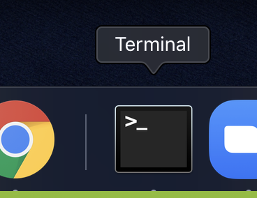
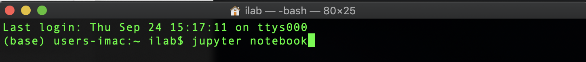
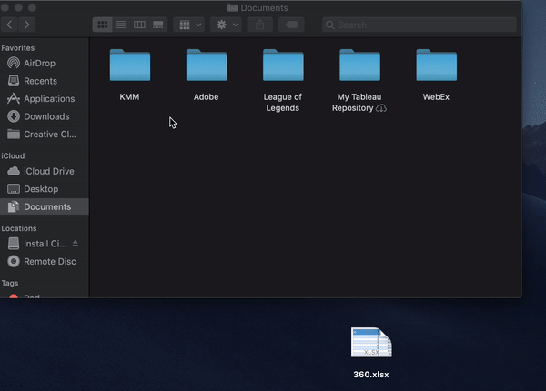
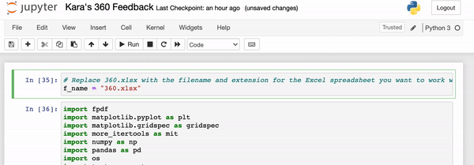
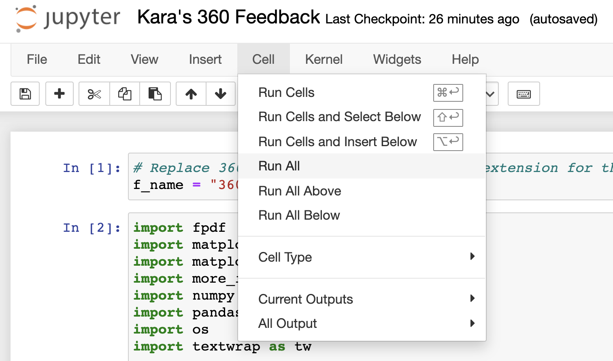
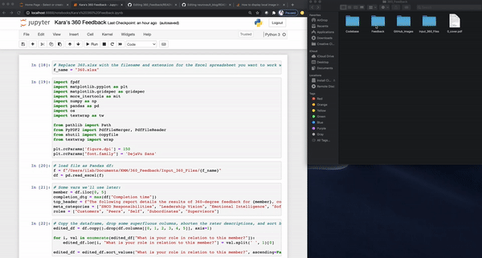
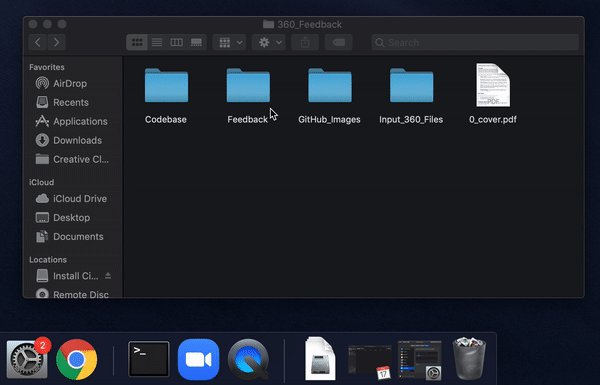

# How to Use the 360 Feedback Report Tool

Welcome to the 360 Feedback report-generator tool, created by MSgt Marszalek. This tool was built using Python 3.8.3 and is intended to be run from the iLab, in Jupyter.

This file explains how to use the tool, including:
1. How to launch it
2. Where to put your input file so that the tool automatically locates it
3. How to run the program to generate and access a 360 Feedback report in Jupyter Notebook, and
4. Best practices for ensuring privacy, including how to manage sensitive files after you've generated a report

## 1: Launching the Tool

To launch the tool in Jupyter Notebook, first open a terminal window:

Next, input the following command to launch Jupyter Notebook (note that this is case sensitive):

Jupyter Notebook will launch in the default browser. 

Double-click the file named "Kara's 360 Feedback.ipynb" to launch the tool.

## 2: Uploading Your Input Excel File to the Environment

For the tool to work, it needs access to the Excel file for the Airman whose 360 Feedback report you aim to generate. To ensure this, save your file in the "Input_360_Files" folder, which can be accessed via the following path: 

Finder -> Documents -> KMM -> 360_Feedback -> Input_360_Files

## 3: How to Generate and Access a 360 Feedback Report in Jupyter Notebook

Now that your file is accessible to the tool (by virtue of being in the "Input_360_Files" folder described in part 2), you're ready to generate your report.

Return to Jupyter Notebook, to the "Kara's 360 Feedback.ipynb" file you've launched, and in the top cell only, change the value of the f_name variable to the exact name and extension of the Excel file you've uploaded:

Once you've done that, simply select "Run All" from the "Cell" drop-down menu:

Notice that when you run the cells, the "Feedback" folder within the 360_Feedack parent directory populates with several files; the most important of which is the finished report, which will be auto-named with the convention "Lastname, Firstname_360 Report.pdf":

Copy this report from the Feedback folder and email it to yourself.

## 4: Protecting Airmen's Privacy Once You've Finished

Now that you've generated and collected your Airman's 360 Feeback report, return to the feedback folder. Drag your Airman's folder—which will be named in the convention "Lastname, Firstname"—into the tash bin, and then right-click the bin and permanently delete the files therein by selecting "Empty Trash":

Once you've done that, if you have no other 360 Feedback reports to process, close Jupyter Notebook <b>without saving</b> by closing the terminal.
